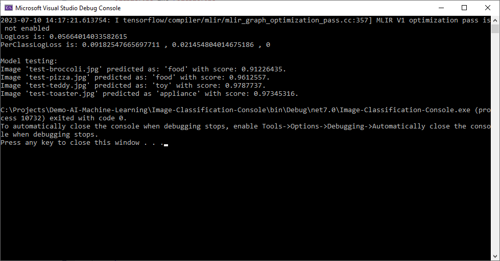
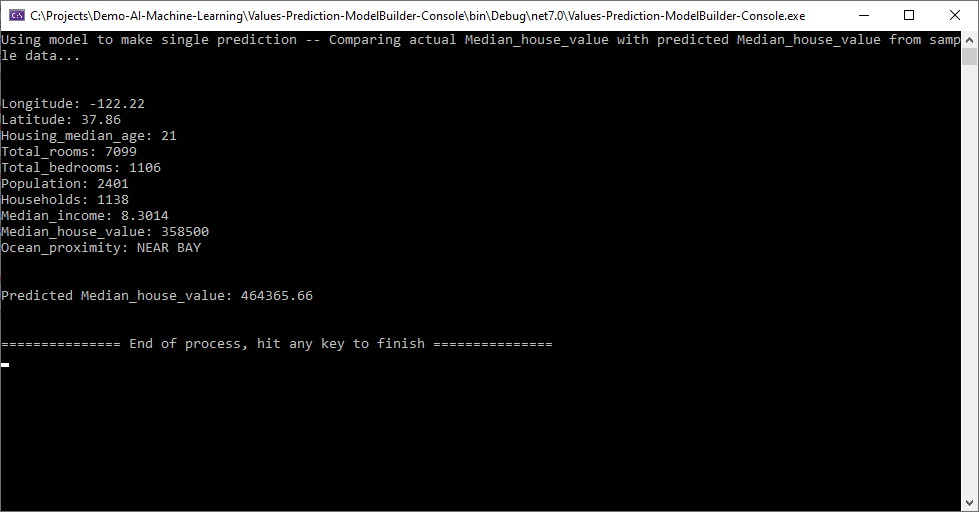
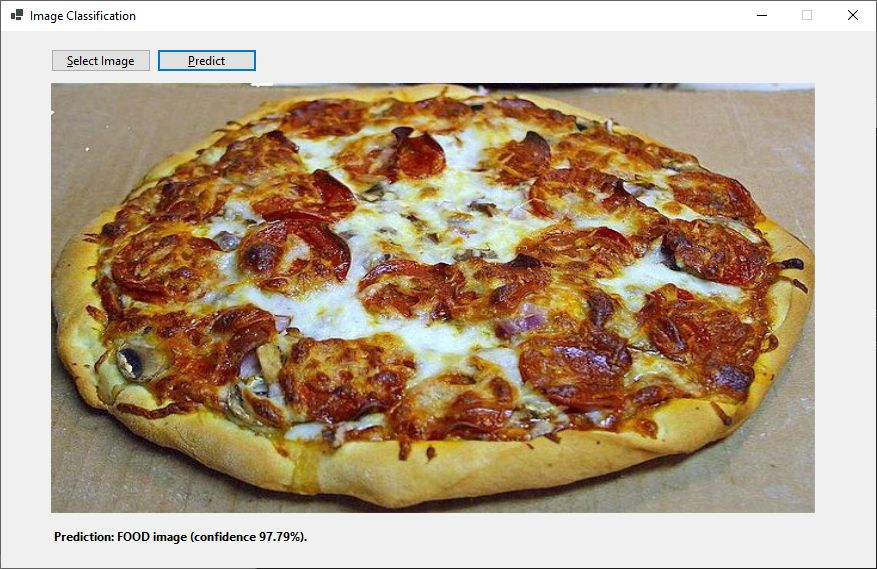
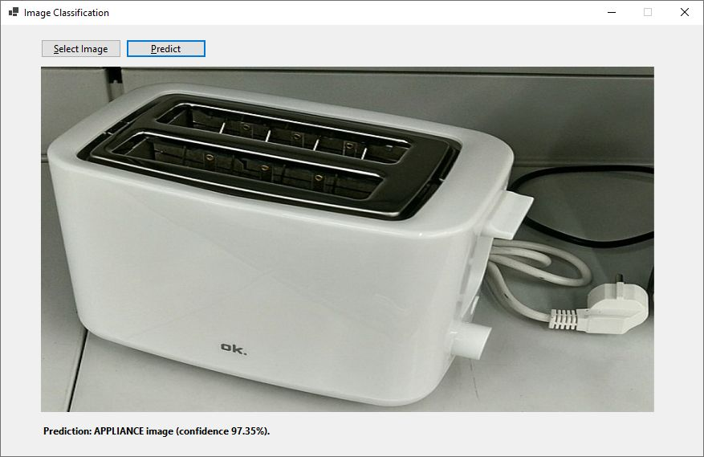

# Demo AI Machine Learning

A demo proyect using .NET 7 (C#) and Microsoft.ML library for values prediction, image classification, and so on.

Datasets:
- [California Housing Prices (kaggle.com)](https://www.kaggle.com/camnugent/california-housing-prices).
- [Tensorflow Inception (tensorflow.org)](https://storage.googleapis.com/download.tensorflow.org/models/inception5h.zip).

&nbsp;

### Proyects

| Name                             | Type     | Description                                                    |
|----------------------------------|----------|----------------------------------------------------------------|
| `Image-Classification-Console`   | Trainer  | Image classifier between 3 categories (food, toy, appliance).  Based on Tensorflow Inception model.  Execute this proyect first to build the model. |
| `Image-Classification-WinForms`  | Consumer | Image classifier sample consumer.                              |
| `Values-Prediction-ByHand`       | Trainer  | Houses price prediction with hand-made model.                  |
| `Values-Prediction-Builder`      | Trainer  | Houses price prediction with model-builder model.              |

&nbsp;

### Screenshots

| Values Prediction (trainning)                       | Image Classification (trainning)                    |
|-----------------------------------------------------|-----------------------------------------------------|
|              |        |

| Image Classification (consumer sample)              |  Image Classification (consumer sample)             |
|-----------------------------------------------------|-----------------------------------------------------|
|        |        |

&nbsp;

### Version History

v1.0 (2023.07.04) - Initial release.  
v1.1 (2023.07.09) - Adding 'Image-Classification-Console' (trainning) project.  
v1.2 (2023.07.10) - Adding 'Image-Classification-WinForms' (consumer) project.  

&nbsp;

This source code is licensed under MIT licence.  
Please send me your feedback about this project: andres.garcia.alves@gmail.com
